<p align="center">
  
</p>

<h2 align="center">📕 Báo Cáo Thực Tập Thực Tế 2026 — BTP Holdings 📕</h2>

<p align="center">
  <a href="https://typst.app/"></a>
  
  
  
  
</p>

<p align="center">
  
  
  
  
  
  
</p>

<h3 align="center">Báo cáo thực tập thực tế tại <a href="https://btpholdings.com.vn/">BTP Holdings</a> — Chi nhánh phía Nam</h3>
<p align="center"><samp>Phòng QC và Phòng Bảo hành SP — sản phẩm gia dụng (bếp đôi từ, máy rửa chén, máy hút mùi, lò vi sóng, nồi cơm điện, nồi chiên không dầu) và một số thiết bị chăm sóc sức khỏe thông minh.</samp></p>

<p align="center">
  
</p>

---

## Tổng quan / Overview

Repository chứa toàn bộ **mã nguồn Typst** + **media archive** của Báo cáo Thực tập Thực tế (BCTT) kỳ học **2025–2026**, được thực hiện tại:

> **CHI NHÁNH PHÍA NAM — CÔNG TY CỔ PHẦN ĐẦU TƯ THƯƠNG MẠI BÁCH TƯỜNG PHÁT (BTP Holdings)**
> Tầng 11, TCT 319 — Pico Plaza, 20 Cộng Hòa, Phường Bảy Hiền, TP. Hồ Chí Minh
> Mã đơn vị: `0109147321-001` · Web: [btpholdings.com.vn](https://btpholdings.com.vn/)

Báo cáo bám theo **mẫu báo cáo thực tập thực tế của Khoa Điện tử — Viễn thông (HCMUS)** và được biên soạn lại bằng **Typst** với:

- card kỹ thuật (`text_card`, `note_card`, `step_card`),
- sơ đồ khối / luồng kỹ thuật (`compact_flow`, `down_arrow`, `right_arrow`),
- photo grid (`photo2`, `photo4`) thay cho bảng dài,
- font Times New Roman 13pt — A4 — leading 0.58em — heading numbering `1.1.1.`,
- danh sách hình, danh sách bảng, mục lục tự sinh, footer trang phải.

## Mục lục báo cáo / Report Structure

| #   | Chương                                                  | Trọng tâm kỹ thuật                                                                  |
| --- | ------------------------------------------------------- | ----------------------------------------------------------------------------------- |
| 0   | Trang bìa + Bìa phụ                                     | Thông tin trường, khoa, bộ môn, sinh viên, đơn vị thực tập                          |
| 0   | Lời cảm ơn, Lời cam đoan, Danh mục viết tắt             | Thủ tục đầu báo cáo theo mẫu Khoa                                                   |
| 1   | **Giới thiệu đơn vị thực tập**                          | Mô hình hoạt động BTP Holdings, vai trò QC &amp; Bảo hành SP, phạm vi thực tập      |
| 2   | **An toàn, quy trình và bộ phận liên quan**             | An toàn điện, lockout/tagout, checklist QC, phối hợp QC ↔ Bảo hành ↔ R&amp;D        |
| 3   | **Sản phẩm và phần điện - điện tử bên trong**           | Bếp đôi từ, máy rửa chén — khối nguồn, mạch công suất, MCU, panel hiển thị, cảm biến |
| 4   | **Quy trình bảo hành SP**                               | Tiếp nhận → chẩn đoán → sửa chữa → kiểm thử sau can thiệp                            |
| 5   | **Quan sát kết nối thiết bị — ứng dụng (IoT)**          | Kết nối Wi-Fi/BLE, hành vi app, kiểm thử ở mức người dùng                            |
| 6   | **Kỹ năng &amp; kiến thức tích lũy**                    | Mapping kiến thức Khoa ↔ thực tế công ty                                             |
| 7   | **Kết luận, đề xuất, nhật ký thực tập**                  | Đề xuất nâng cấp quy trình, bảng nhật ký 400 giờ                                    |
| —   | **Tài liệu tham khảo (IEEE)** + **Phụ lục**             | `.bib` IEEE style, phụ lục checklist &amp; mẫu phiếu                                |

## Cây thư mục / Repository Layout

```
.
├── main.typ                       # Entry point — set page, set text, include 7 chương
├── config.typ                     # Meta (sinh viên, đơn vị, GVHD), card, flow, photo utilities
├── tai_lieu_tham_khao.bib         # Bibliography (IEEE style)
├── fonts/                         # Times New Roman family (.TTF) — bundled cho build offline
├── src/
│   ├── 00_trang_bia_va_bia_phu.typ
│   ├── 01_loi_cam_on.typ
│   ├── 02_loi_cam_doan.typ
│   ├── 03_danh_muc_viet_tat.typ
│   ├── 04_chuong_1.typ            # Giới thiệu đơn vị
│   ├── 05_chuong_2.typ            # An toàn &amp; quy trình
│   ├── 06_chuong_3.typ            # Sản phẩm &amp; phần điện tử
│   ├── 07_chuong_4.typ            # Quy trình bảo hành
│   ├── 08_chuong_5.typ            # Kết nối IoT
│   ├── 09_chuong_6.typ            # Kỹ năng tích lũy
│   ├── 10_chuong_7.typ            # Kết luận &amp; đề xuất
│   └── 11_phu_luc.typ
├── assets/                        # ⚠️ Cần được populate từ media-archive/ trước khi build
└── media-archive/                 # Raw photo archive (chưa rename)
    ├── HinhAnhBTP_Latest/
    │   ├── HinhAnhCuocHop/        # Họp kỹ thuật, training "Kích hoạt chất Đức"
    │   ├── HinhAnhCuocHop2/
    │   ├── HinhAnhCuocHop3/
    │   ├── HinhAnhLinhKien/       # PCB, linh kiện, board công suất, MCU
    │   ├── HoiNghiBaoHanh/        # Hội nghị bảo hành SP
    │   ├── LunarNewYear/          # Văn phòng đầu năm
    │   ├── MayRuaChen_Bep_PhongBaoHanh/   # Bếp từ, máy rửa chén, khu sửa chữa
    │   └── VanPhongCongTy/        # Reception, work area, workspace
    └── HinhAnhNhanSu/             # 4 ảnh chân dung dùng cho trang bìa / lời cảm ơn
```

## Build PDF / Reproducible Build

### Yêu cầu
- [`typst`](https://typst.app/) ≥ 0.13 (CLI hoặc Typst Web App)
- Font **Times New Roman** đã được bundle trong `fonts/` — không cần cài thêm
- (Khuyến nghị) cài thêm fallback: *Liberation Serif*, *Noto Serif*, *DejaVu Sans Mono* để loại bỏ warning

### Lệnh build

```bash
# Compile thẳng ra PDF
typst compile main.typ BCTT_LuongHaiLong_22207056.pdf --font-path fonts

# Hoặc watch-mode khi đang chỉnh sửa
typst watch main.typ --font-path fonts
```

### Populate `assets/` trước khi build

Vì `media-archive/` là **ảnh thô** chưa được rename, để build PDF thành công bạn cần copy + rename ảnh theo bảng mapping dưới:

| Tên file cần có (trong `assets/`)                                              | Lấy từ thư mục                                |
| ------------------------------------------------------------------------------ | --------------------------------------------- |
| `office_reception.jpg`, `office_workspace.jpg`, `office_work_area.jpg`         | `media-archive/HinhAnhBTP_Latest/VanPhongCongTy/` |
| `technical_meeting.jpg`, `warranty_conference.jpg`                             | `HinhAnhCuocHop*/`, `HoiNghiBaoHanh/`         |
| `warehouse_product.jpg`, `appliance_overview.jpg`, `appliance_back_hose.jpg`   | `MayRuaChen_Bep_PhongBaoHanh/`                |
| `dishwasher_open.jpg`, `dishwasher_inner_marked.jpg`, `dishwasher_side_marked.jpg`, `dishwasher_door_marked.jpg`, `dishwasher_pump_area.jpg`, `dishwasher_pump_detail.jpg` | `MayRuaChen_Bep_PhongBaoHanh/`                |
| `stove_control_panel.jpg`, `stove_internal_coil.jpg`, `stove_dual_fan.jpg`, `stove_power_module.jpg` | `MayRuaChen_Bep_PhongBaoHanh/`                |
| `panel_board_long.jpg`, `power_board_close.jpg`, `control_display_module.jpg`, `small_mcu_close.jpg`, `connector_module.jpg`, `ic_solder_close.jpg`, `board_extra_01..04.jpg` | `HinhAnhLinhKien/`                            |
| `board_cable_overview.jpg`, `board_wiring_close.jpg`                           | `HinhAnhLinhKien/`                            |
| `workbench_qc.jpg`, `workbench_test_area.jpg`, `test_computer.jpg`, `workshop_overview.jpg`, `checklist_record.jpg`, `lockout_tag.jpg` | `MayRuaChen_Bep_PhongBaoHanh/`, `HinhAnhCuocHop3/` |
| `warranty_extra_01..04.jpg`, `component_extra_01..04.jpg`                      | `HinhAnhLinhKien/`, `HoiNghiBaoHanh/`         |

> Sau khi populate `assets/`, lệnh `typst compile main.typ` sẽ chạy sạch.

## Thông tin pháp lý &amp; học thuật / Academic &amp; Legal

<table>
  <tr>
    <td><b>Sinh viên</b></td><td>Lương Hải Long — MSSV <code>22207056</code></td>
  </tr>
  <tr>
    <td><b>Lớp / Khóa</b></td><td>Khóa 2022 — Hệ Chất lượng cao — Kỹ thuật Điện tử Viễn thông</td>
  </tr>
  <tr>
    <td><b>Cơ sở đào tạo</b></td><td>Trường ĐH Khoa học Tự nhiên, ĐHQG-HCM — Khoa Điện tử Viễn thông — Bộ môn Máy tính Hệ thống nhúng</td>
  </tr>
  <tr>
    <td><b>Đơn vị tiếp nhận</b></td><td>Chi nhánh phía Nam — CTCP Đầu tư Thương mại Bách Tường Phát (BTP Holdings)</td>
  </tr>
  <tr>
    <td><b>Người hướng dẫn</b></td><td>Ông Trần Văn Cát — Phó phòng Bảo hành SP</td>
  </tr>
  <tr>
    <td><b>Thời gian thực tập</b></td><td>12/01/2026 — 10/04/2026 (≈ 400 giờ)</td>
  </tr>
  <tr>
    <td><b>Email liên hệ</b></td><td><a href="mailto:22207056@student.hcmus.edu.vn">22207056@student.hcmus.edu.vn</a></td>
  </tr>
</table>

## Engineering signal cho HR / Engineering Signal for HR

- **Kỹ thuật:** quan sát hệ thống điện-điện tử trong sản phẩm gia dụng thực, hiểu nguyên lý khối nguồn, mạch công suất, MCU điều khiển, cảm biến, panel hiển thị, cơ cấu chấp hành.
- **Quy trình:** an toàn điện, lockout/tagout, checklist QC, vòng đời tiếp nhận → chẩn đoán → sửa → kiểm thử lại của Bảo hành SP.
- **Tài liệu:** tự xây dựng template Typst chuẩn theo mẫu HCMUS, có heading numbering, bibliography IEEE, photo grid, sơ đồ khối — không dùng Word.
- **Phối hợp:** giao tiếp với phòng QC, Bảo hành SP, R&amp;D, Đào tạo — quan sát luồng dữ liệu lỗi quay trở lại R&amp;D.
- **Mindset:** tôn trọng an toàn, viết theo đúng vai trò *thực tập sinh — quan sát, ghi nhận, đối chiếu* — không phóng đại đóng góp cá nhân.

## Liên quan / See also

- [`DoAnHeThongNhung`](https://github.com/lhlizdabezt/DoAnHeThongNhung) — Đồ án Hệ thống nhúng (DE10-Standard SoC, TCP/Ethernet)
- [`Slide-DoAnHTN-Nhom17-DE10Standard`](https://github.com/lhlizdabezt/Slide-DoAnHTN-Nhom17-DE10Standard) — Slide bảo vệ đồ án HTN Nhóm 17 (Stargazer Typst theme)
- [`HCMUS-DTVT-BaoCao-Templates`](https://github.com/lhlizdabezt/HCMUS-DTVT-BaoCao-Templates) — Templates &amp; guide Typst cho KLTN/BCTT

## License

- Mã nguồn Typst (template, macros, layout): **MIT License** — xem [LICENSE](LICENSE).
- Nội dung báo cáo (text, sơ đồ, kết luận) và toàn bộ ảnh trong `media-archive/`: **© 2026 Lương Hải Long &amp; BTP Holdings.** Vui lòng không tái sử dụng cho mục đích thương mại hay nộp lại như báo cáo của bạn.

<p align="center">
  <sub>Made with <a href="https://typst.app/">Typst</a> · Báo cáo soạn theo mẫu BCTT của Khoa Điện tử Viễn thông — HCMUS · Khóa 2022 CLC</sub>
</p>
