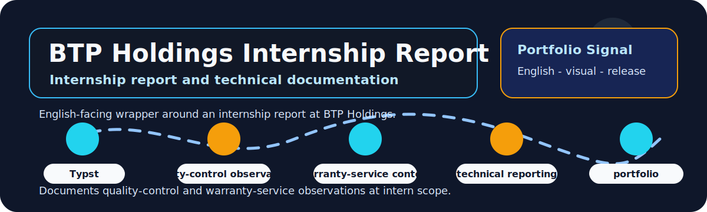

# BTP Holdings Internship Report Portfolio Wrapper

  
  
  

  

## Overview

This repository presents an internship report at BTP Holdings with an English-facing portfolio wrapper around quality-control and warranty-service observations.

| Field | Details |
|---|---|
| Repository | [BCTT-ThucTap-BTPHoldings](https://github.com/lhlizdabezt/BCTT-ThucTap-BTPHoldings) |
| Portfolio category | Internship report and technical documentation repository |
| Primary stack | Typst, technical report writing, quality-control observations, warranty-service context, release PDF. |
| Latest release | [GitHub Releases](https://github.com/lhlizdabezt/BCTT-ThucTap-BTPHoldings/releases/latest) |
| Tags | [Version tags](https://github.com/lhlizdabezt/BCTT-ThucTap-BTPHoldings/tags) |
| Owner profile | [Luong Hai Long](https://github.com/lhlizdabezt) |

## Reviewer Map

| What to Review | Where to Look | Why It Matters |
|---|---|---|
| Technical scope | This README and source tree | Gives a quick, bounded reading path before opening every file |
| Evidence assets | Release page and top-level project files | Shows what can be downloaded or inspected quickly |
| Implementation material | Source folders, scripts, notebooks or design files | Connects the portfolio claim to real project artifacts |
| Version history | Tags and release notes | Makes the repository easier to audit over time |

## Evidence Highlights

- Typst source and release PDF for the internship report.
- Quality-control and warranty-service observation context.
- Home-appliance product and limited IoT exposure noted at intern scope.
- Documentation discipline for a professional environment.

## Repository Structure

| Path | Purpose |
|---|---|
| `assets/` | Top-level directory included in the repository |
| `docs/` | Top-level directory included in the repository |
| `fonts/` | Top-level directory included in the repository |
| `media-archive/` | Top-level directory included in the repository |
| `src/` | Top-level directory included in the repository |
| `config.typ` | Top-level file included in the repository |
| `LICENSE` | Top-level file included in the repository |
| `main.typ` | Top-level file included in the repository |

## Scope and Boundaries

Internship report repository. It is evidence of observation, documentation and limited technical exposure, not a claim of full product ownership.

## Role and Portfolio Context

Luong Hai Long authored and packaged the report as part of internship and portfolio documentation.

## Release and Tagging Notes

This repository is maintained as part of an English-facing engineering portfolio. Releases and tags are used to preserve reviewable snapshots of the project, including source state, documentation updates and any available visual or report assets.

## Writing Standard

The README follows an evidence-first style: direct technical nouns, clear project boundaries, release-backed artifacts and no inflated claims beyond what the repository can support.
