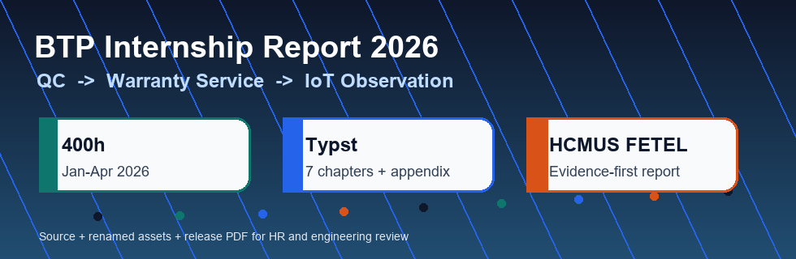

<p align="center">
  
</p>

<h1 align="center">📘 Báo cáo Thực tập Thực tế 2026 tại BTP Holdings</h1>

<p align="center">
  <a href="https://github.com/lhlizdabezt/BCTT-ThucTap-BTPHoldings/releases/latest"></a>
  <a href="https://typst.app/"></a>
  
  
</p>

<p align="center">
  
  
  
  
</p>

<p align="center">
  
</p>

## Tóm tắt

Repository này lưu **mã nguồn Typst, ảnh minh chứng, tài liệu tham khảo và release PDF** cho Báo cáo Thực tập Thực tế 2026 của **Lương Hải Long - MSSV 22207056**, sinh viên ngành **Kỹ thuật Điện tử - Viễn thông**, Trường Đại học Khoa học Tự nhiên, ĐHQG-HCM.

Kỳ thực tập được thực hiện tại **Chi nhánh phía Nam - Công ty Cổ phần Đầu tư Thương mại Bách Tường Phát (BTP Holdings)** trong giai đoạn **12/01/2026 - 10/04/2026**, tổng thời lượng khoảng **400 giờ**. Nội dung chính tập trung vào môi trường **QC**, **Bảo hành SP**, sản phẩm điện gia dụng, bo mạch thật, kiểm thử sau sửa chữa và quan sát kết nối thiết bị - ứng dụng ở mức thực tập sinh.

README được viết theo hướng portfolio kỹ thuật: người đọc có thể thấy nhanh bối cảnh, phạm vi, bằng chứng, cách build và giá trị kỹ thuật mà báo cáo thể hiện. Phần nội dung vẫn giữ giới hạn trung thực: đây là báo cáo thực tập, không tự nhận vai trò thiết kế sản phẩm, phát triển firmware nội bộ hay xử lý toàn bộ quy trình kỹ thuật của doanh nghiệp.

## Liên kết nhanh

| Mục | Liên kết | Ghi chú |
| --- | --- | --- |
| Repository | [BCTT-ThucTap-BTPHoldings](https://github.com/lhlizdabezt/BCTT-ThucTap-BTPHoldings) | Nguồn Typst, ảnh, release và metadata của báo cáo |
| Release mới nhất | [GitHub Releases](https://github.com/lhlizdabezt/BCTT-ThucTap-BTPHoldings/releases/latest) | Nơi tải PDF build sẵn và source snapshot |
| Tags | [Danh sách tag](https://github.com/lhlizdabezt/BCTT-ThucTap-BTPHoldings/tags) | Dùng để đánh dấu từng bản đóng gói ổn định |
| GitHub cá nhân | [lhlizdabezt](https://github.com/lhlizdabezt) | Portfolio kỹ thuật của Lương Hải Long |
| LinkedIn | [linkedin.com/in/lhlizdabezt](https://www.linkedin.com/in/lhlizdabezt) | Hồ sơ nghề nghiệp và kinh nghiệm thực tập |
| Đơn vị thực tập | [btpholdings.com.vn](https://btpholdings.com.vn/) | Website BTP Holdings |

## Thông tin chính

| Trường thông tin | Nội dung |
| --- | --- |
| Sinh viên | **Lương Hải Long** |
| MSSV | `22207056` |
| Trường | Trường Đại học Khoa học Tự nhiên, ĐHQG-HCM |
| Khoa | Điện tử - Viễn thông |
| Khóa / hệ | K2022 - Chất lượng cao |
| Đơn vị thực tập | Chi nhánh phía Nam - BTP Holdings |
| Bộ phận quan sát chính | QC và Bảo hành SP |
| Người hướng dẫn tại đơn vị | Ông Trần Văn Cát - Phó phòng Bảo hành SP |
| Thời gian | 12/01/2026 - 10/04/2026 |
| Thời lượng | Khoảng 400 giờ |
| Công cụ soạn thảo | Typst, Times New Roman, bibliography IEEE, ảnh minh chứng đã đổi tên |

## Giá trị kỹ thuật cho HR và engineering

| Tín hiệu đánh giá | Bằng chứng trong repo | Ý nghĩa khi đọc hồ sơ |
| --- | --- | --- |
| Tư duy hệ thống | Chương về QC, Bảo hành SP, sản phẩm điện gia dụng, bo mạch, nguồn, công suất, cảm biến và kết nối app | Cho thấy khả năng nhìn thiết bị theo khối chức năng, không chỉ viết mô tả chung |
| Tài liệu kỹ thuật có cấu trúc | Source Typst 7 chương, phụ lục, mục lục, danh sách hình, bibliography IEEE và release PDF | Có khả năng đóng gói báo cáo có thể review, build lại và lưu vết bằng Git |
| Trung thực về phạm vi | README và báo cáo ghi rõ vai trò thực tập sinh: quan sát, hỗ trợ, ghi nhận và đối chiếu | Tránh phóng đại đóng góp, phù hợp phong cách đánh giá của kỹ sư |
| Gắn ngành Điện tử - Viễn thông với thực tế | Nội dung liên hệ mạch điện, điện tử công suất, cảm biến, hệ thống nhúng, IoT và kiểm thử | Hữu ích cho định hướng firmware, embedded, kiểm thử phần cứng và tích hợp sản phẩm |
| Portfolio sẵn sàng chia sẻ | Có badge, visual, GIF motion, metadata, topics, release, tag và link cá nhân rõ ràng | HR hoặc mentor kỹ thuật có thể đánh giá nhanh mà không phải mở từng file thô |

## Cấu trúc báo cáo

| Phần | Nội dung | Trọng tâm |
| --- | --- | --- |
| Trang bìa, lời cảm ơn, cam đoan | Thủ tục đầu báo cáo theo mẫu Khoa | Thông tin sinh viên, đơn vị thực tập và tính học thuật |
| Chương 1 | Giới thiệu đơn vị thực tập | Bối cảnh BTP Holdings, QC, Bảo hành SP và phạm vi thực tập |
| Chương 2 | Môi trường và nội dung thực tập | Nhật ký 400 giờ, giai đoạn quan sát, cách chuyển ghi chú thành báo cáo |
| Chương 3 | Thực tập tại Phòng QC | Kiểm tra sản phẩm, đọc cấu trúc thiết bị, ghi nhận rủi ro chất lượng |
| Chương 4 | Thực tập tại Phòng Bảo hành SP | Triệu chứng lỗi, kiểm tra bo mạch, sửa chữa và kiểm thử lại sau can thiệp |
| Chương 5 | Quan sát kết nối thiết bị - ứng dụng | IoT ở mức quan sát, phản hồi app, điều kiện kết nối và giới hạn mô tả |
| Chương 6 | Kết quả và kỹ năng tích lũy | Bài học về an toàn, ghi nhận kỹ thuật, sản phẩm thật và tư duy hệ thống |
| Chương 7 | Kết luận và kiến nghị | Hướng học tiếp, checklist quan sát và đề xuất cho quá trình thực tập |
| Phụ lục | Checklist rút gọn và tài liệu bổ sung | Hỗ trợ kiểm tra, ghi nhận và đối chiếu |

## Cây thư mục

```text
.
|-- main.typ                         # Entry point của báo cáo
|-- config.typ                       # Thông tin sinh viên, macro card, flow, photo grid
|-- tai_lieu_tham_khao.bib           # Tài liệu tham khảo theo IEEE
|-- src/                             # 7 chương, phụ lục và các trang đầu báo cáo
|-- assets/                          # Ảnh đã đổi tên đúng với source Typst và GIF motion cho README
|-- docs/banner.svg                  # Banner tự host, chữ trong SVG giữ ASCII để tránh lỗi dấu
|-- media-archive/                   # Ảnh gốc từ quá trình thực tập, giữ để truy vết nguồn ảnh
|-- fonts/                           # Times New Roman được bundle để build ổn định
|-- RELEASE_NOTES.md                 # Ghi chú release tiếng Việt
|-- LICENSE                          # License cho phần template/macro Typst
```

## Build PDF

Yêu cầu:

- `typst` phiên bản 0.14.x hoặc mới tương thích.
- Không cần cài thêm Times New Roman vì repo đã có thư mục `fonts/`.
- Ảnh trong `assets/` đã được populate sẵn từ `media-archive/`, nên có thể build ngay sau khi clone.

Lệnh build:

```powershell
typst compile main.typ BCTT_LuongHaiLong_22207056.pdf --font-path fonts
```

Lệnh watch khi đang chỉnh báo cáo:

```powershell
typst watch main.typ --font-path fonts
```

## Nội dung đã được đóng gói

| Hạng mục | Trạng thái | Ghi chú |
| --- | --- | --- |
| Source Typst | Có | `main.typ`, `config.typ`, `src/*.typ` |
| Ảnh build trực tiếp | Có | `assets/*.jpg` đã đổi tên đúng với các lệnh `image(...)` trong Typst |
| Ảnh gốc | Có | `media-archive/` giữ theo thư mục ban đầu để truy vết |
| Font | Có | Times New Roman `.TTF` trong `fonts/` |
| Bibliography | Có | `tai_lieu_tham_khao.bib`, style IEEE |
| Visual README | Có | Banner SVG, badge, GIF motion và bảng tóm tắt |
| Release PDF | Có | Đính kèm trong GitHub Release mới nhất |

## Ranh giới học thuật và pháp lý

Phần **template, macro Typst, cấu trúc trình bày và README** được phát hành theo giấy phép trong [LICENSE](LICENSE). Phần **nội dung báo cáo, ảnh minh chứng và ghi chú thực tập** thuộc về Lương Hải Long và BTP Holdings theo bối cảnh học thuật, không dùng lại cho mục đích thương mại hoặc nộp lại như báo cáo của người khác.

Một số thông tin nội bộ, dữ liệu khách hàng, quy trình chi tiết hoặc lỗi riêng của sản phẩm không được đưa vào repo. Báo cáo chỉ giữ phần đủ để phản ánh quá trình thực tập và bài học kỹ thuật ở mức phù hợp với sinh viên.

## Repository liên quan

| Repo | Liên quan |
| --- | --- |
| [lhlizdabezt](https://github.com/lhlizdabezt/lhlizdabezt) | README profile tổng hợp portfolio kỹ thuật |
| [HCMUS-DTVT-BaoCao-Templates](https://github.com/lhlizdabezt/HCMUS-DTVT-BaoCao-Templates) | Template và tài liệu báo cáo học thuật |
| [DoAnHeThongNhung](https://github.com/lhlizdabezt/DoAnHeThongNhung) | Đồ án Hệ thống nhúng với DE10-Standard SoC FPGA |
| [ThucHanhGTMT](https://github.com/lhlizdabezt/ThucHanhGTMT) | Lab giao tiếp máy tính, BLE, UART, SQLite và thu nhận dữ liệu |

<p align="center">
  <sub>Soạn bằng Typst - tổ chức bằng GitHub - trình bày theo hướng portfolio kỹ thuật cho HR và engineering review.</sub>
</p>
