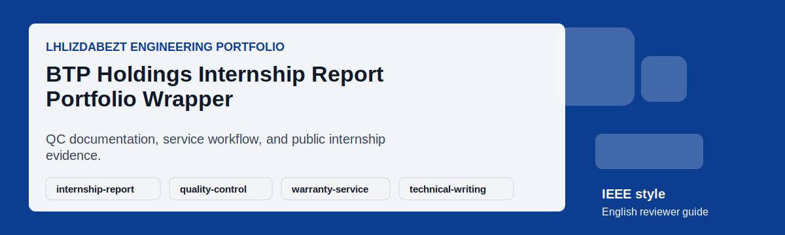
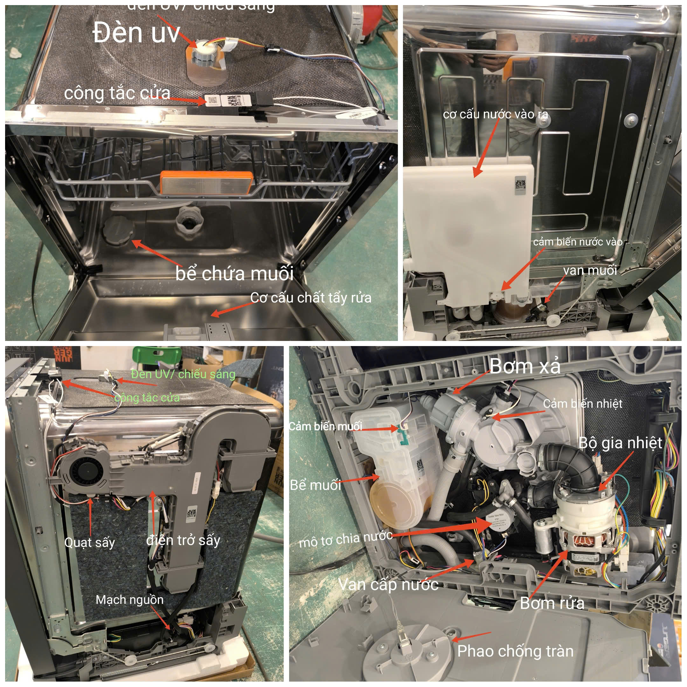
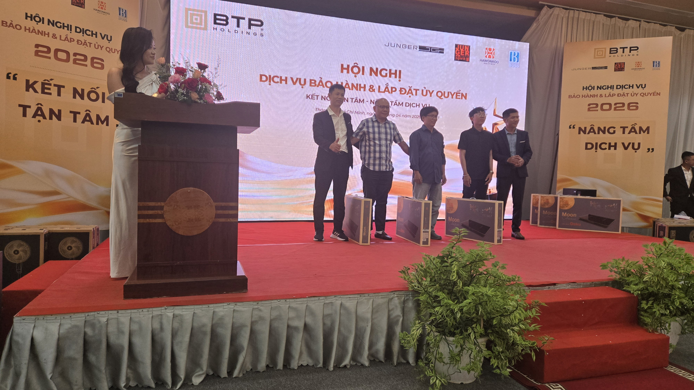
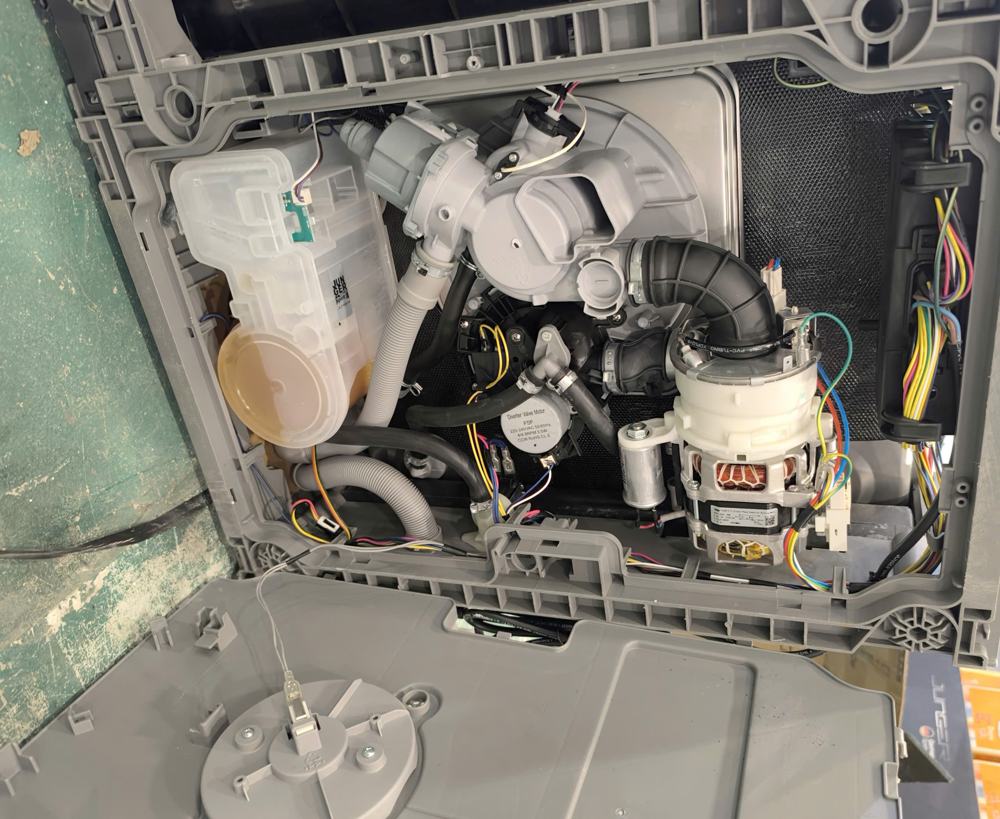

# BTP Holdings Internship Report Portfolio Wrapper

## Executive Summary

This repository presents the BTP Holdings internship report as a recruiter-readable engineering portfolio artifact. It emphasizes quality-control observation, warranty-service workflow, consumer-electronics handling, documentation discipline, and evidence-backed reporting rather than overstating confidential business operations.

## Project Snapshot

| Field | Details |
|---|---|
| Repository | [lhlizdabezt/BCTT-ThucTap-BTPHoldings](https://github.com/lhlizdabezt/BCTT-ThucTap-BTPHoldings) |
| Portfolio Track | Internship report, quality control, warranty service, and technical documentation |
| Public Status | Reviewer-ready English guide with release-backed evidence |
| Latest Release | [Open stable release](https://github.com/lhlizdabezt/BCTT-ThucTap-BTPHoldings/releases/latest) |
| Owner Profile | [lhlizdabezt](https://github.com/lhlizdabezt) |
| Contact | 22207056@student.hcmus.edu.vn; luonghailong.work@gmail.com; Tel: +84988114708 |

## Reviewer Evidence Map

- Typst report source and configuration for consistent academic formatting.
- Workbench, workshop, and warranty-service photographs used as visual evidence.
- English captions and release notes for HR, academic reviewers, and engineering supervisors.
- A scoped portfolio wrapper that separates public review material from private internship details.

## Implementation Review Notes

| Review Point | What To Check |
|---|---|
| Problem framing | Confirm that the README explains the engineering purpose without exaggerated claims. |
| Technical evidence | Inspect the source folders, reports, scripts, schematics, or visual assets listed below. |
| Reproducibility | Use the local instructions where tools are available, or rely on the release snapshot for portfolio review. |
| Communication quality | Check headings, captions, tables, and release notes for clear English technical writing. |
| Professional boundary | Treat the repository as educational or portfolio evidence unless the source explicitly proves production deployment. |

## Repository Structure

| Path | Reviewer Purpose |
|---|---|
| `main.typ` | Primary Typst entry point for the internship report. |
| `config.typ` | Report configuration and reusable metadata. |
| `src/` | Report sections and supporting Typst content. |
| `assets/` | Public visual evidence, motion graphics, and reviewer-safe images. |
| `RELEASE_NOTES.md` | Release changelog for the current English reviewer guide. |

## How To Review

- Start with the executive summary in this README to understand the public scope.
- Review `main.typ`, `config.typ`, and `src/` to inspect report structure and formatting discipline.
- Open `assets/` to verify the internship evidence images and captions.
- Use the latest GitHub release for a stable snapshot of the reviewed portfolio state.

## How To Use Or Inspect Locally

- Install Typst if you want to compile the source locally.
- Run `typst compile main.typ` from the repository root when the local Typst environment is available.
- If you only need to review the portfolio, read this README and the latest release notes first.
- Use the images under `assets/` as supporting evidence, not as private operational disclosure.

## Visual Evidence

*Animated English reviewer card.*

*Workbench quality-control evidence.*

*Warranty-service and training context.*

*Workshop environment overview.*

## Release, Tags, And Topics

- Current release target: `reviewer-guide-2026-06-02`.
- Recommended topic set: `internship-report, quality-control, warranty-service, technical-writing, typst, electronics, consumer-electronics, documentation, hcmus, btp-holdings`.
- Release notes are maintained in [`RELEASE_NOTES.md`](RELEASE_NOTES.md) for stable reviewer traceability.
- The release archive is intended for HR review, seminar evidence, and academic portfolio verification.

## Contact And Professional Links

| Channel | Link |
|---|---|
| GitHub | [https://github.com/lhlizdabezt](https://github.com/lhlizdabezt) |
| LinkedIn | [https://www.linkedin.com/in/lhlizdabezt](https://www.linkedin.com/in/lhlizdabezt) |
| Facebook | [https://www.facebook.com/wageseadrake](https://www.facebook.com/wageseadrake) |
| Instagram | [https://www.instagram.com/lhlizdabezt](https://www.instagram.com/lhlizdabezt) |
| YouTube | [https://www.youtube.com/@lhlizdabezt](https://www.youtube.com/@lhlizdabezt) |
| TikTok | [https://www.tiktok.com/@wageseadrake](https://www.tiktok.com/@wageseadrake) |
| Academic Email | [22207056@student.hcmus.edu.vn](mailto:22207056@student.hcmus.edu.vn) |
| Professional Email | [luonghailong.work@gmail.com](mailto:luonghailong.work@gmail.com) |
| Phone | [+84988114708](tel:+84988114708) |

## FAQ

| Question | Answer |
|---|---|
| Is this a public version of the internship report? | Yes. It is written as a public portfolio wrapper and avoids private operational claims. |
| What should a reviewer focus on? | Documentation quality, evidence organization, technical observation, and professional communication. |
| Does the repository claim production ownership at BTP Holdings? | No. It presents an internship learning record and public-facing documentation evidence. |

## Scope And Boundaries

- This repository is presented as public engineering portfolio evidence.
- Claims are intentionally limited to what the repository, report, source files, simulations, or visual assets can support.
- Public text is written in English (United States) for HR, faculty, and engineering reviewers.
- SVG text is kept ASCII-safe to reduce rendering errors, mojibake, and missing-glyph blocks.
- Motion visuals avoid moving dotted paths, curved connector lines, and text-over-line compositions.

## Writing Standard

The public README, release notes, captions, and reviewer-facing metadata are written in a restrained IEEE and Harvard-inspired style: concise, evidence-first, technically accurate, and suitable for Electronics and Telecommunications portfolio review.
